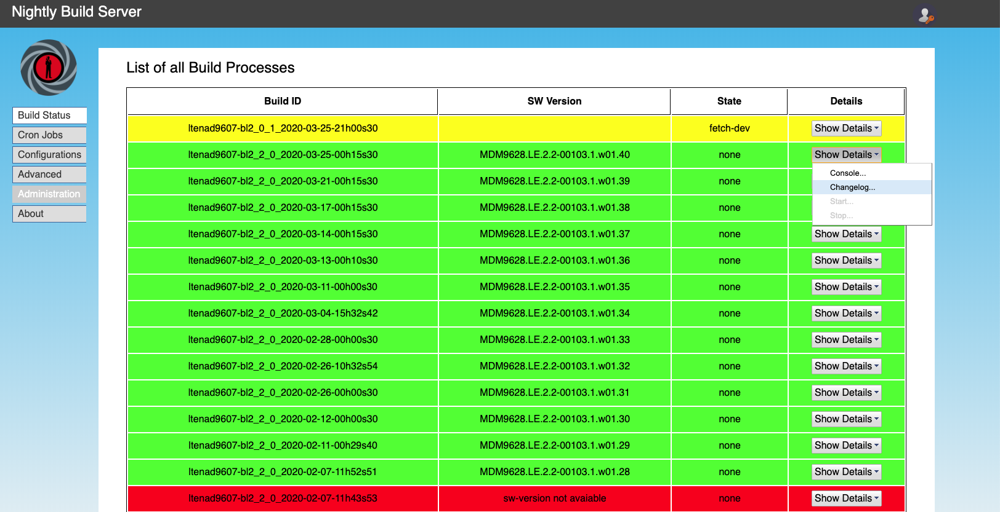

# The Bond Nightly Release System

A Functional Programming Environment for the Automatic Creation of Software Release Candidates



## Object - Why do we need this?

When dealing  with complex and long  running software build processes  for multi
core network access devices,  'industry standard' continous integration concepts
have proven insufficient for  us. One reason for this conclusion  is that a full
compilation process  can depending on  the capabilities of used  hardware easily
take several hours. In  addition, it can not be predicted  when a build actually
shall  be started  in  the majority  of the  cases  simply because  dependencies
between  different parts  of the  software are  unknown or  cannot be  correctly
mapped by  the source code  management system. This  leads to a  situation where
automatic  builds  which are  triggered  by  any  given  change in  source  code
repositories in  the period of minuts  mostly fail. Besides, there  is usually a
high effort to  take into account for  testing which is very  difficult to fully
automate in our  domain.

It therefore  seems to  us to be  much more practicable  to run  fully automated
build  and release  processes  at  night. While  this  is  easily possible  with
existing solutions,  these have  still major shortcomings.  The main  problem we
face is that  typical domain specific progamming languages (DSL)  in use are not
really flexible, but still complex and static. By the last point we mean that in
example it is usually not possible to  fix problems within the source code or in
the  build sequence  without  restarting the  complete build.  That  leads to  a
situation  where major  parts of  the software  release process  are still  done
manually usually by  a software integrator. As a last  consequence, this results
in a  situation where changes to  the source code (commits)  are integrated with
significant delay.  Instead of  getting a  complete build  for these  changes at
least on a daily  base, it often takes more than a week  until a given changeset
is finally integrated.

With this project we try to address these problems. Like typical CI solutions it
is based  on the execution  of a sequence of  build steps which  are exclusively
remotely executed on  a build host via  ssh. Whenever a build step  fails, it is
possible to address the  problem by changing the source code  on that build host
and restart the sequence again. The  processing engine for these build sequences
is implemented  in Clojure  which is a  highly dynamic  programming environemnt.
This allows  to change even  the underlying  implementation of this  CI solution
without  restarting within  an interactive  programming environment,  called the
[REPL](https://en.wikipedia.org/wiki/Read%E2%80%93eval%E2%80%93print_loop).  The
last point requires of course some  knowledge of Clojure and associated software
tools but  also without such specific  knowledge, this tools should  prove to be
very useful.


## Requirements

The  present  tool  itself  is  entrily  written  in  the  [Clojure  programming
language](http://clojure.org) which  requires a Java virtual  machine of version
1.8 or later and some additional libraries for operation.

Furthermore  it can  be exclusively  used on  Unix hosts  since it  envokes some
system tools  directly e.g. 'ssh',  'scp', 'cp', etc. and  thus it is  not '100%
pure Java'.


## Installation and First Start

Download the  precompiled binary using  the following command as  illustrated in
the following shell command:

    wget https://github.com/linneman/nightly-build/releases/download/v1.0.5/bond-1.0.5-standalone.jar

The nightly build service daemon is started via the following command line:

    java -jar bond-1.0.5-standalone.jar

When the  server is started for  the first time, the  following preference files
are initially installed in the user's home directory:

    .nightly-build/local_settings.clj      # server configuration
    .nightly-build/key_crt.jks             # Java Key Store with SSL certificates
    build-descriptions/sample_config.clj   # sample build configuration
    build-descriptions/ltenad_config.clj   # practical application example

The file  local_settings.clj provides most  of configuration parameters  such as
the http(s) and REPL ports to be used.  By default the web server can be reached
on port 3000 on localhost.

All build configurations are stored in the directory build-descriptions. When it
does  not  exist  already,  it  is created  and  two  sample  configuration  are
preinstalled by default. When no error occured, you should be able to access
the server on the local host via the following URL:

[http://localhost:3000](http://localhost:3000)

Provided  that the  server  is accessible  under the  hostname  being used,  the
following URL should also work:

[http://&lt;domain-name&gt;:3000](http://domain-name:3000)

If  not,   the  domain   name  to   be  used   can  be   changed  in   the  file
.nightly-build/local-settings with the parameter *http-host*.

Immediately after starting the server, an administration URL is displayed on the
local console:

    ______________ Administration Account ______________
    Copy and paste the following URL into your brower to
    active the administration account:

    http://<hostname>:3000/confirm?name=admin&key=iUMXdnWbPzwExRz%2BclC8xA%3D%3D

    ____________________________________________________

This  URL  is  used  to  unlock  the administrator  account  and  must  be  used
immediately after starting  the server. Via the login button  in the upper right
corner  of the  web interface  a new  password should  be assigned  to the  user
'admin'.


## Compiling nightly-build

You need  the clojure build  tool leinignen  for compilation. Download  the lein
script file from Github

    $ cd ~/bin
    $ wget http://github.com/technomancy/leiningen/raw/stable/bin/lein
    $ chmod +x lein

and type

    $ lein self-install

The following command will generate and stand-alone jar file:

    $ lein uberjar

Refer also to
[Zef's Leiningen page](http://zef.me/2470/building-clojure-projects-with-leiningen)
for more specific information about build options.


## Usage

The use of  the web interface is largely self-explanatory.  The radio buttons on
the left side can be used to select the respective functions. The most important
point  is  the 'Build  Status',  in  which the  build  results  for all  release
candidates are  displayed in  a comprehensive  list. This  list is  empty during
initial start-up.

Using the  menu item  'Cron Jobs',  build processes can  be started  manually or
time-controlled.

The menu item  'Configurations' allows to change build  configurations or create
new  ones.  However,  for  the  development  of  complicated  build  procedures,
the  use  of external  development  tools  is  recommended.  You can  find  more
information about this  under the menu item 'Advanced' or  in the section [Build
Configurations](#Build-Configurations) further down in the text.


### Starting the First Test Build

In directory build-descriptions the  build configuration 'sample_config.clj' was
added which can be executed immediately. The only requirement is a key based ssh
authentication to the local or any remote build machine. Refer to
[this tutorial](https://www.digitalocean.com/community/tutorials/how-to-configure-ssh-key-based-authentication-on-a-linux-server)
for more detail information how to set this up.

The  easiest way  is  to use  the  local host  as a  build  machine. If  ssh-key
authentication is  installed correctly, the  following command should  print the
contents of the root directory without a password prompt.

    ssh localhost "ls /"

If this is the case, first activate the  cron table via the menu item 'Cron'. In
the table  row 'create-build-description-sample-1' select the  entry 'Start' via
the button 'Action'. The build is started immediately and displayed in the table
'Build Status'. There you can get further information like the console output of
the build process and stop and restart the build process.


### Setting up Additional Users

New users  can be created  under the menu item  'Administration'. Administration
rights are required for this. The following roles can be assigned to users:

role    | allowed actions
--------|----------------
admin   | create new users, change build configurations
control | Starting and stopping build processes, changes to the front table
view    | new allocation of the own password

The currently used rights configuration allows  that unlogged users can at least
view all build configurations. If this is  not desired, this can be adjusted via
the access-method-hash data structure in the server/core.cljs file.


### Build Configuration

All build configurations are fully  declared within a single configuration file.
Three data structures are used:

1. The crontab declares at which times specific builds are started
2. A build description fully describes a build process. It encapsulates:
3. A sequence of build step actions which are executed via remote ssh.

Refer also to the help page
[Creating Build Descriptions](https://htmlpreview.github.io/?https://github.com/linneman/nightly-build/blob/master/resources/public/creating-build-descriptions.html)
for further information.

Whenever  a  new  build  process  is triggered,  a  new  build-task-sequence  is
instantiated. All build-task-sequences  are internally stored within  a hash map
using an unique identifier  which consist of the build name and  the time it has
been started. It can be later on retrieved and restarted by utility functions
illustrated [in the source file build_task.clj](src/nightly_build/build_task.clj#L476).
Before we illustrate these underlying processes  in more detail, we will explain
the three major configuration structures.


#### The Crontab

What needs to be done at which time is defined by the so called crontab which is
based on the corresponding [Unix construct](https://en.wikipedia.org/wiki/Cron).
The  crontab  is created  at  startup  or at  any  later  time by  invoking  the
function  [restart-cron-processing](src/nightly_build/core.clj#L51)  with  using
cron build  descriptions defined in  the configuration file. The  data structure
cron-build-description is  an array of hash  maps denoted by curly  braces. Each
element of  the array  corresponds to  the tigger points  of one  specific build
described by  a build description  handler. The  hash map provide  the following
key value pairs:

<dl>
  <dt>m</dt>
  <dd>minute to start the build</dd>
  <dt>h</dt>
  <dd>hour to start the build</dd>
  <dt>dom</dt>
  <dd>day of month when to start the build. Use false to start at any day</dd>
  <dt>mon</dt>
  <dd>month when to start the build. Use false to start at any month</dd>
  <dt>dow</dt>
  <dd>day of week when to start the build. Use false to start at any week</dd>
</dl>

In  example  the  following  cron-build-description definition  will  start  the
associated build at daily at wo o'clock in the morning:

```clojure
(def cron-build-descriptions
  [{:m 0 :h 02 :dom false :mon false :dow false
    :desc create-build-description-mdm9607-bl2_2_0}])
```

The entries of the crontab can also be easily edited via the web interface under
the menu item 'Cron Jobs'.


#### The Build Description

The build description is the main data  structure which defines all aspects of a
complete build process.  It mainly includes template variables such  as the host
where the build  is executed on, directories, repository and  branch names to be
used and so on.  Since often similar builds with only  minor differences such as
in example different  branches for different hardware releases  are required, we
separate the actual build steps from the build description.

Ultimately the build description is created by a dedicated function in the build
configuration file which returns a hash map with the concrete configuration. Its
most import key value pairs are:

<dl>
  <dt>build-uuid</dt>
  <dd>an unique identifier string describing the build. Usually the combination
      of the build name and the creation date is used.</dd>

  <dt>build-log-filename</dt>
  <dd>log file where all build output is stored on the host which runs the
      nightly build daemon</dd>

  <dt>build-machine</dt>
  <dd>remote build host controlled via ssh described by hostname and port</dd>

  <dt>task-list</dt>
  <dd>the list of concrete tasks which are executed (mostly) via remote ssh
      on the build host. The tasks are executed on after another until
      the execution of one task fails.</dd>

  <dt>terminate</dt>
  <dd>provides one termination task which is executed on the machine which
      is running the nightly build service and an optional finalization
      handler which is in example used to send out a status email. The
      terminate function is always executed.</dd>
</dl>


#### Build Steps and Termination Handler

As already mentioned, the task-list and the terminate function are created by
a separate function. Refer in example to
[create-build-steps-ltenad9607](resources/build-descriptions/ltenad_config.clj#L85) for an
illustration of the describtion all the steps for a complex build process.

The most important aspect  is the so called task list which is  simply a list of
vector with the following structure:

```clojure
(list
  [<id1> <commands> <timeout>]
  [<id2> <commands> <timeout>]
  ...)
```

Each build steps is described by an  identifier (id), a string of shell commands
which are  executed via  remote ssh and  a timeout after  the remote  process is
automatically interrupted and considered as having failed.

A key based ssh authentication to remote build machine is a prerequisite. Refer
to
[this tutorial](https://www.digitalocean.com/community/tutorials/how-to-configure-ssh-key-based-authentication-on-a-linux-server) for more detail information how to set this up.

The termination handler is excuted always  and allows to provide tasks for clean
up, sending  up status information,  etc. In the provided  example we use  it to
copy the complete build  log file back to the associated  build directory on the
build host and  to send out a  status email indicating whether or  not the build
was successful.

Refer also to the help page
[Creating Build Descriptions](https://htmlpreview.github.io/?https://github.com/linneman/nightly-build/blob/master/resources/public/creating-build-descriptions.html)
for further information.


## Interactive Control of Build Processes via the REPL

The   [REPL](https://en.wikipedia.org/wiki/Read%E2%80%93eval%E2%80%93print_loop)
allows to modify all aspects of the nightly-build service engine without the need
of a  restart which  is one  is its  major benifits.  When started,  the service
automatically creates a [nREPL](https://nrepl.org)  services which is by default
configured  to exclusively  allow local  connections via  port 7888.  For remote
connection ssh port forwarding can be used to deal with access credentials.

Besides the mostly used combination of [Emacs](https://www.gnu.org/software/emacs)
and [Cider](https://cider.readthedocs.io), there are even integrated development
environments (IDE's) for nREPL based development in Clojure. Refer in exjample to
[Cursive](https://cursive-ide.com) which is based on the IntelliJ IDEA and
[Counter Clock Wise](http://doc.ccw-ide.org) which is based on Eclipse.

In example  start a new connection  to the nREPL  server on Emacs by  typing M-x
cider-connect followed  by entering 'localhost'  for the  Host and 7888  for the
port. The IDE's  offer similar functionality which is described  in the relevant
help files.

Refer to the help page
[Connecting an external REPL](https://htmlpreview.github.io/?https://github.com/linneman/nightly-build/blob/master/resources/public/connecting-an-external-repl.html)
for an  illustration of  various integrated  development environments  and their
specific advantages and disadvantages.


### (Re)Starting and Stopping Processing of the Crontable

Switch the  current name space to  the command line interface  (cli) definitions
within  the file  [core.clj](src/nightly_build/core.clj)  which can  be done  in
Emacs by  typing C-c M-n. The  IDE's provide corresponding functionality.  As an
alternative copy and paste the following line to the REPL window (cider):

    (in-ns 'nightly-build.core)

With the commands

    (stop-cron-processing)
    (restart-cron-processing)

The processing  of cron jobs  will be  stopped respectively restarted.  When the
build definitions  within the  configuration files have  been changed,  the file
shall be re-evaluted in example by the following command before:

    (load-file "build-descriptions/<build-configuration>.clj")

With  the flag  'enabled' specific  cron  jobs can  be deactivated  via the  web
interface as well.


### Investigating Running and Completed Builds

Switch the current name space to build-tasks and invoke the following commands:

    (get-all-build-uuids)

The function will return nil when no build have been defined (executed yet).
For testing and development purposes it is recommended to execute the commands
in the comment section of
[the source file build_task.clj](src/nightly_build/build_task.clj#406):

In example:

The following lines create a new build sequence:

```clojure
(def task-sequence-id (gen-build-task-sequence create-build-description-mdm9607-bl2_2_0
                                               build-log-handler))
```

which can be simply started by

```clojure
(start-build-task-sequence task-sequence-id)
```

The    functions    is-task-sequence-running?,    get-task-sequence-state    and
get-last-error allow further retrieval of the  build state. When a build failed,
its last failed build step can be restarted at any time by invoking the function
start-build-task-sequence again.  All currently running or  terminated tasks are
stored in  an internal  hash table  - the tasks  store -  whose contents  can be
retrieved via  the function get-all-build-uuids. The  associated task-sequences,
build  descriptions and  so  on  can be  retrieved  with  the respective  getter
functions.


## License

This software stands under the terms of the
[GNU General Public Licence](http://www.gnu.org/licenses/gpl.html).

2019, Otto Linnemann
